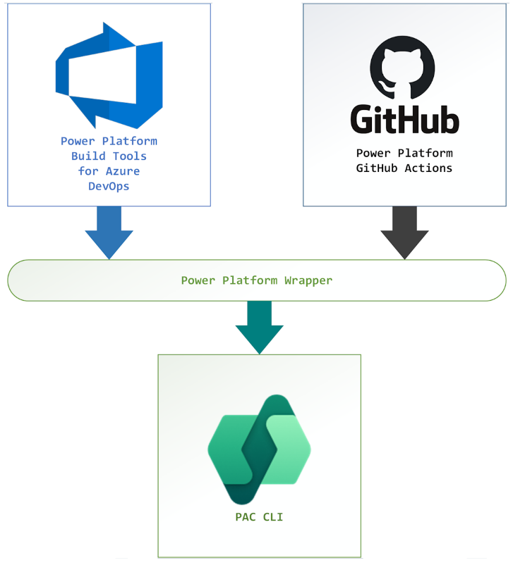

# Welcome to the Microsoft Power Platform Developer Tools Community!

Power Platform Developer Tools automate common build and deployment tasks related to Power Platform.
This includes synchronization of solution metadata (a.k.a. solutions) between development environments and source control,
generating build artifacts, deploying to downstream environments, provisioning/de-provisioning of environments,
and the ability to perform static analysis checks against your solution using the PowerApps checker service.

Below are some ways that you can get involved in the MPPDT Community.

## Engage on Github

File issues, submit PRs, and provide feedback and ideas to what you'd like to see from the Power Platform Developer Tools.
We do our best to respond to each submission.

## Public Community Office Hours

We regularly have Community Office Hours that are open to the **public** to join. 

Add Power Platform Developer Tools events to your calendar: download the [calendar.ics](docs/PPDeveloperTools-OfficeHours.ics) file.

To keep topics organized, please submit what you'd like us to cover here:
[https://aka.ms/ProDevOfficeHours](https://aka.ms/ProDevOfficeHours)

If you are unable to make it live, all meetings will be recorded and posted online.

## Feedback & Questions

Please use the issues tracker in the home repo: <https://github.com/microsoft/powerplatform-build-tools/issues>

Learn more about the Build Tools [here](https://aka.ms/buildtoolsdoc).

Each tasks wraps the existing [Power Platform CLI](https://aka.ms/PowerPlatformCLI).

## Power Platform Developer Blog

[Power Platform Developer Blog](https://devblogs.microsoft.com/powerplatform/)

## High level architecture

.
